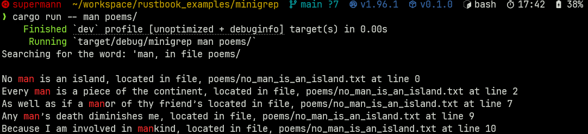
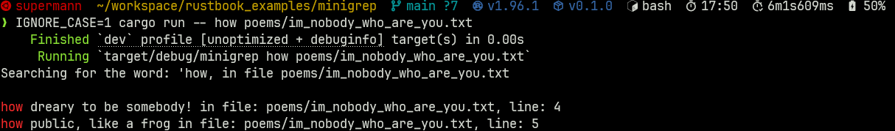
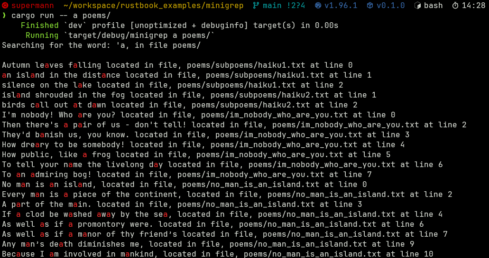
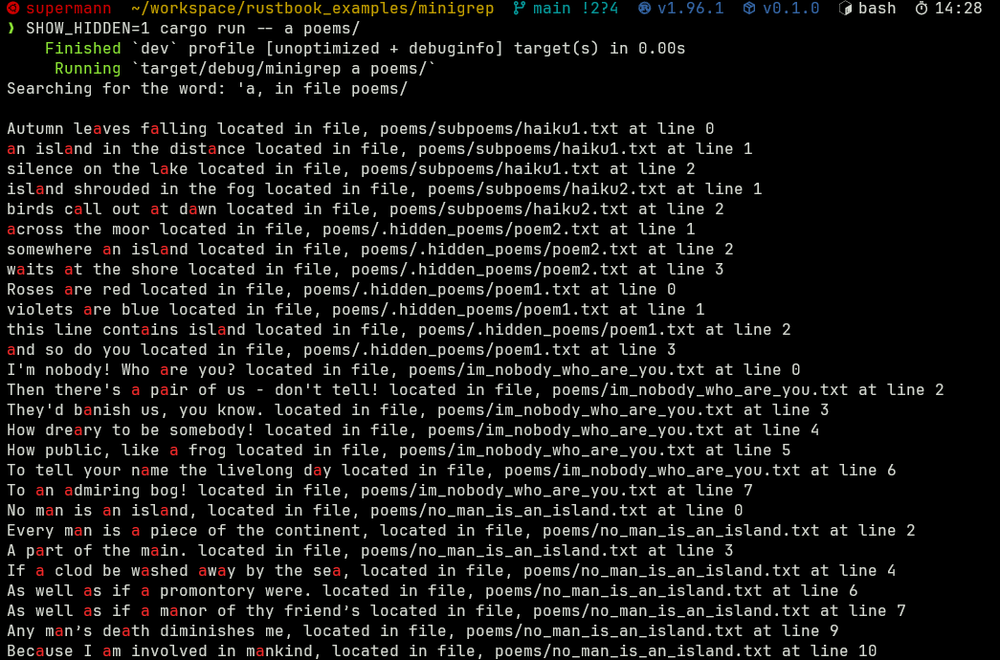

# minigrep

A tiny, colorful `grep` clone in Rust to search a file or a whole directory tree for a word and get every matching line back with the match highlighted, plus its file and line number. An extended take on the classic [Rust Book](https://doc.rust-lang.org/book/ch12-00-an-io-project.html) I/O project, with colored output and recursive directory search added on top.

## Features

- Highlighted matches (bold red), via [`colored`](https://crates.io/crates/colored)
- Search a single file or a whole directory, recursing into subdirectories
- Case-insensitive mode with the `IGNORE_CASE` environment variable
- Hidden files and folders are skipped by default, opt in with `SHOW_HIDDEN`
- Symlinks are skipped, and files larger than 1 MB are ignored
- Every hit reports its file and line number

## Usage

```bash
cargo run -- <query> <path>                 # search a file or directory tree
cargo run -- <query>                        # path defaults to "."
IGNORE_CASE=1 cargo run -- <query> <path>   # case-insensitive
SHOW_HIDDEN=1 cargo run -- <query> <path>   # include hidden files and folders
```

The `poems/` directory ships with a small tree to try it out on:

```text
poems/
  im_nobody_who_are_you.txt      I'm Nobody! Who are you?  by Emily Dickinson
  no_man_is_an_island.txt        No Man Is an Island       by John Donne
  subpoems/
    haiku1.txt
    haiku2.txt
  .hidden_poems/
    poem1.txt
    poem2.txt
```

For example:

```bash
cargo run -- man poems/                     # recurse the tree for "man"
IGNORE_CASE=1 cargo run -- how poems/im_nobody_who_are_you.txt
SHOW_HIDDEN=1 cargo run -- the poems/       # also search .hidden_poems/
```

## Demo

Searching a whole directory:



Case-insensitive search:



Recursing into subdirectories:



Including hidden files with `SHOW_HIDDEN`:



## How it works

| Piece                                | Job                                                                                                          |
| ------------------------------------ | ------------------------------------------------------------------------------------------------------------ |
| `Config::build`                      | Parses the CLI args and reads `IGNORE_CASE` and `SHOW_HIDDEN` from the environment                           |
| `search` / `search_case_insensitive` | Walk the lines, collect the hits, and paint the matched term red                                             |
| `search_file`                        | Reads a single file and searches its contents                                                                |
| `search_directory`                   | Recurses the tree, skipping symlinks, hidden entries, and oversized files, and searches every remaining file |

`main.rs` inspects the given path: if it is a directory it dispatches to `search_directory`, if it is a file it uses `search_file`, and otherwise it bails out with an error.
